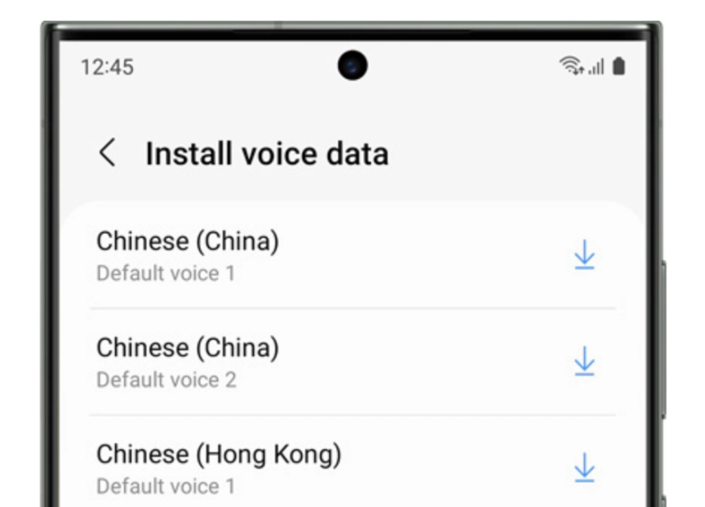

[Back](../help.md)

## How to Set Text-to-Speech Language to Chinese

1. Open **Settings**.
2. Swipe to and then tap **General management**.
3. Tap **Text-to-speech**.
4. Set the language to **Chinese**.
5. If you do not find **Chinese** in the language settings, follow the steps in [**"How to Download new voices"**](#How-to-Download-New-Voices) to add a Chinese language pack and try step 4 again.

### How to Download new voices
1. Open **Settings**, then swipe to and tap **General management**.
2. Tap **Text-to-speech**.
3. Tap the **Settings** icon next to **Preferred engine**.
4. Tap **Install voice data**.
5. Swipe to the voice data you'd like to install. Far thehenSamsung engine, tap the download icon, and tap **Download**. For the Google engine, tap the language, and then tap the download icon.

